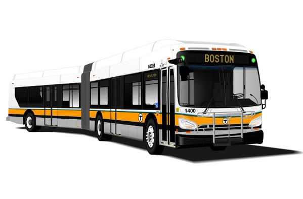

  [![MIT License][license-shield]][license-url]
  [![LinkedIn][linkedin-shield]][linkedin-url]


<br />

<p align="center">

  <a href="https://github.com/jtourkis/MBTA-Ridership-Model">
    
  </a>
  
  <h3 align="center">MBTA Bus Ridership Model</h3>

  <p align="center">
    The goal of this repository is to explore possible mechanistic models of MBTA bus pickups using various probability distributions.
    <br />
    <a href="https://github.com/jtourkis/MBTA-Ridership-Model"><strong>Explore the docs »</strong></a>
    <br />
    <br />
    <a href="https://github.com/jtourkis/MBTA-Ridership-Model">View Demo</a>
    ·
    <a href="https://github.com/jtourkis/MBTA-Ridership-Model/issues">Report Bug</a>
    ·
    <a href="https://github.com/jtourkis/MBTA-Ridership-Model/issues">Request Feature</a>
  </p>
</p>


<!-- TABLE OF CONTENTS -->
## Table of Contents

* [About the Project](#about-the-project)
  * [Built With](#built-with)
* [Getting Started](#getting-started)
  * [Prerequisites](#prerequisites)
  * [Installation](#installation)
* [Usage](#usage)
* [Roadmap](#roadmap)
* [Contributing](#contributing)
* [License](#license)
* [Contact](#contact)
* [Acknowledgements](#acknowledgements)


<!-- ABOUT THE PROJECT -->
## About The Project

The project uses data from the Massachusetts Bay Transit Authority (MBTA) describing average rider boarding by bus stop, time, and route. The data covers fall seasons from 2016 to 2019. I plan to approximate the distribution of different subsets of MBTA data using a number of statistical techniques, such as maximum likelihood estimation and method of moments.  

### Built With

* [R](https://www.r-project.org) / [R Studio](https://rstudio.com)
* [Python](https://www.python.org) / [Jupyter Notebook](https://jupyter.org)


<!-- GETTING STARTED -->
## Getting Started

To get a local copy up and running follow these simple steps.

### Prerequisites

List of required packages. 
* dplyr
```sh
install.packages("dplyr")
```
* tidyverse
```sh
install.packages("tidyverse")
```
* ggplot2
```sh
install.packages("ggplot2")
```
### Installation
 
1. Clone the repo

```sh
git clone https://github.com/jtourkis/MBTA-Ridership-Model.git
```
2. Install packages
```sh
install.packages()
```


<!-- USAGE EXAMPLES -->
## Usage

Use this space to show useful examples of how a project can be used. Additional screenshots, code examples and demos work well in this space. You may also link to more resources.

_For more examples, please refer to the [Documentation](https://example.com)_


<!-- ROADMAP -->
## Roadmap

1. Explore data and identify potential probability distribtions. 
2. Find maximum likelihood and method of moments estimates to simulate data for proposed distributions. 
3. Test Goodness of Fit. Run Kolmogorov-Smirnov (Continuous) or Chi-Squared (Discrete) Tests to assess whether proposed distributions should be rejected. 
4. Run additional testing to find best fit. 

See the [open issues](https://github.com/github_username/repo/issues) for a list of proposed features (and known issues).


<!-- CONTRIBUTING -->
## Contributing

Contributions are what make the open source community such an amazing place to be learn, inspire, and create. Any contributions you make are **greatly appreciated**.

1. Fork the Project
2. Create your Feature Branch (`git checkout -b feature/AmazingFeature`)
3. Commit your Changes (`git commit -m 'Add some AmazingFeature'`)
4. Push to the Branch (`git push origin feature/AmazingFeature`)
5. Open a Pull Request


<!-- LICENSE -->
## License

Distributed under the MIT License. See `LICENSE` for more information.

Note: The intial README Template was distributed under the MIT License. Copyright (c) 2018 Othneil Drew. [LICENSE](https://github.com/othneildrew/Best-README-Template/blob/master/LICENSE.txt)  for more information. 


<!-- CONTACT -->
## Contact

James Tourkistas - jmtourkistas@suffolk.edu

Project Link: [https://github.com/jtourkis/MBTA-Ridership-Model](https://github.com/jtourkis/MBTA-Ridership-Model)


<!-- ACKNOWLEDGEMENTS -->
## Acknowledgements

* [Best-README-Template](https://github.com/othneildrew/Best-README-Template/blob/master/BLANK_README.md) 
* [MBTA Bus Ridership by Time Period, Season, Route/Line, and Stop Dataset](https://mbta-massdot.opendata.arcgis.com/datasets/mbta-bus-ridership-by-time-period-season-route-line-and-stop)


<!-- MARKDOWN LINKS & IMAGES -->
<!-- https://www.markdownguide.org/basic-syntax/#reference-style-links -->
[license-shield]: https://img.shields.io/github/license/othneildrew/Best-README-Template.svg?style=flat-square
[license-url]: https://github.com/jtourkis/MBTA-Ridership-Model/blob/master/LICENSE.txt
[linkedin-shield]: https://img.shields.io/badge/-LinkedIn-black.svg?style=flat-square&logo=linkedin&colorB=555
[linkedin-url]: https://www.linkedin.com/in/james-tourkistas-7127ba167/
[product-screenshot]: images/screenshot.png
